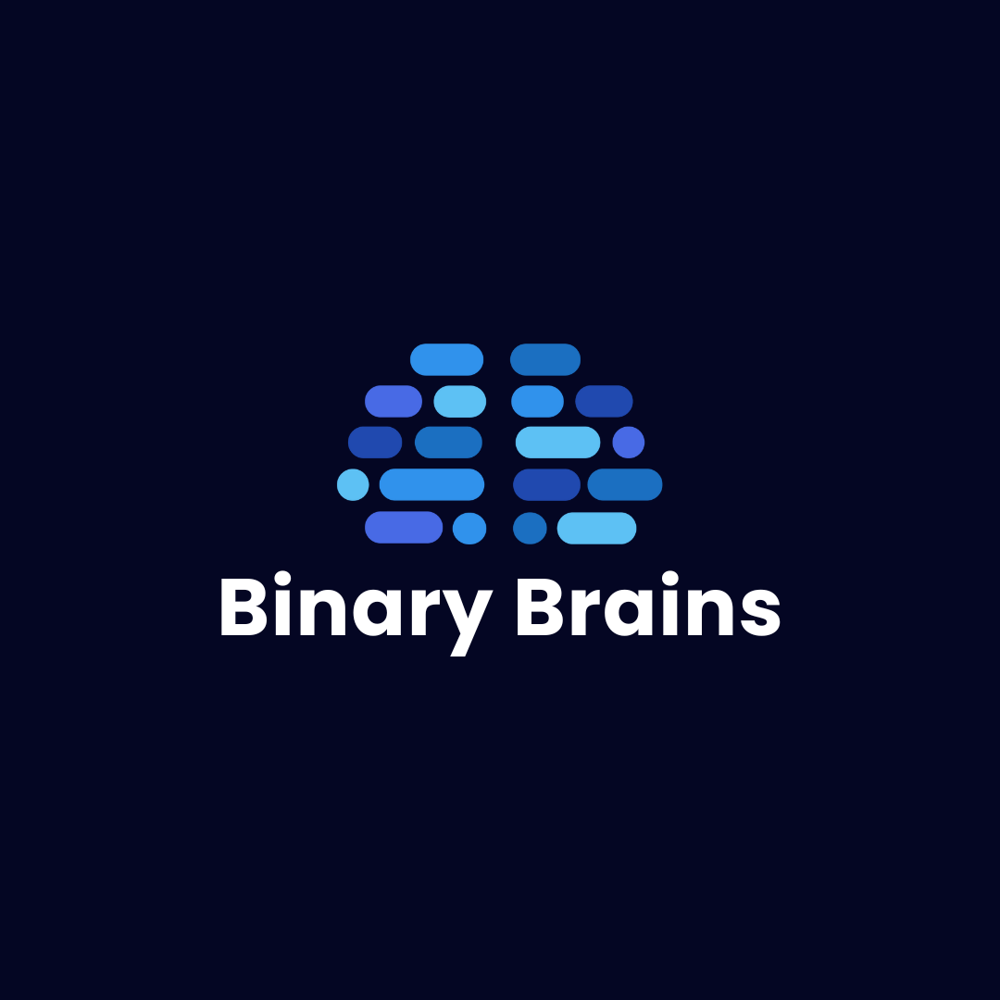
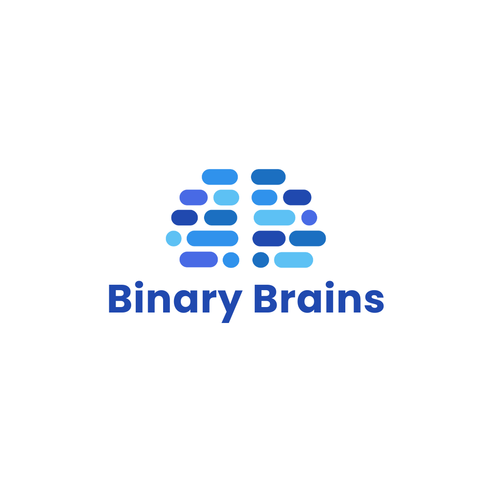
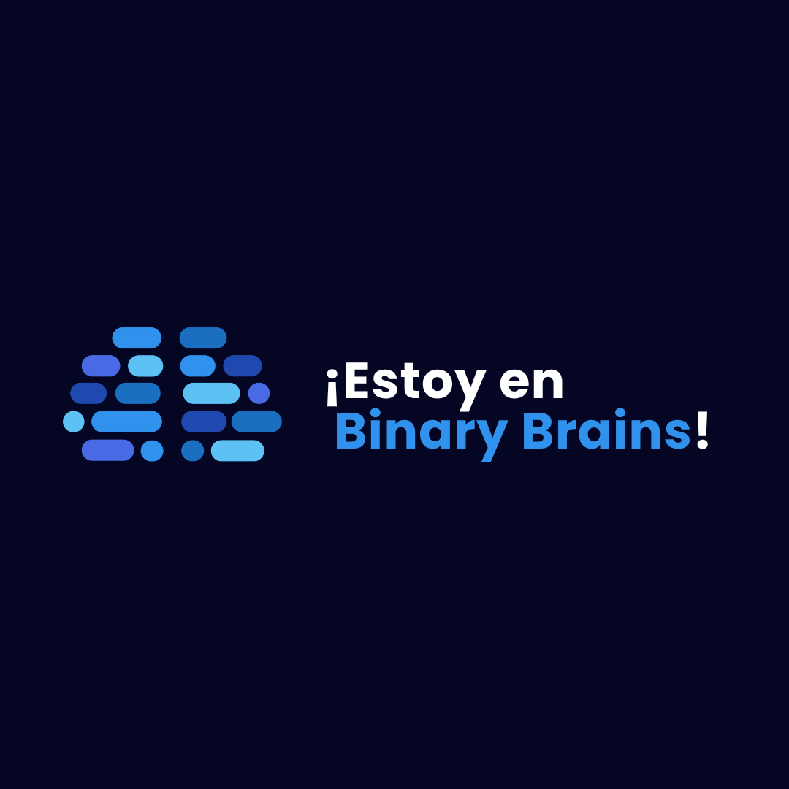
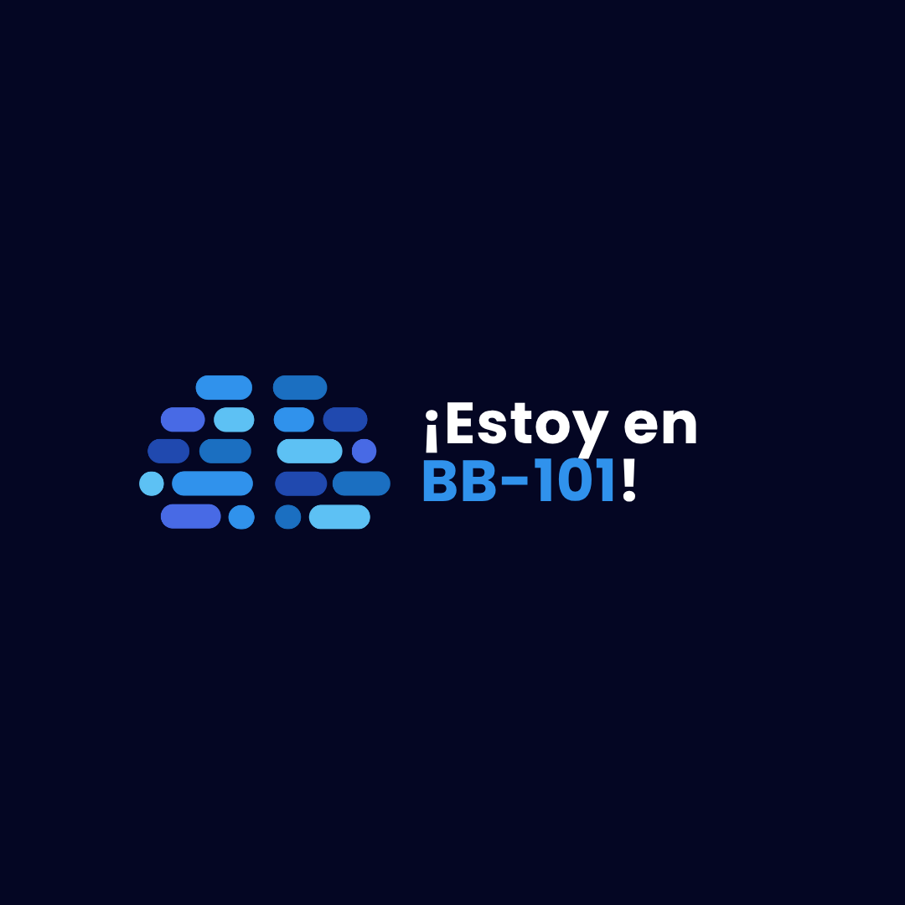
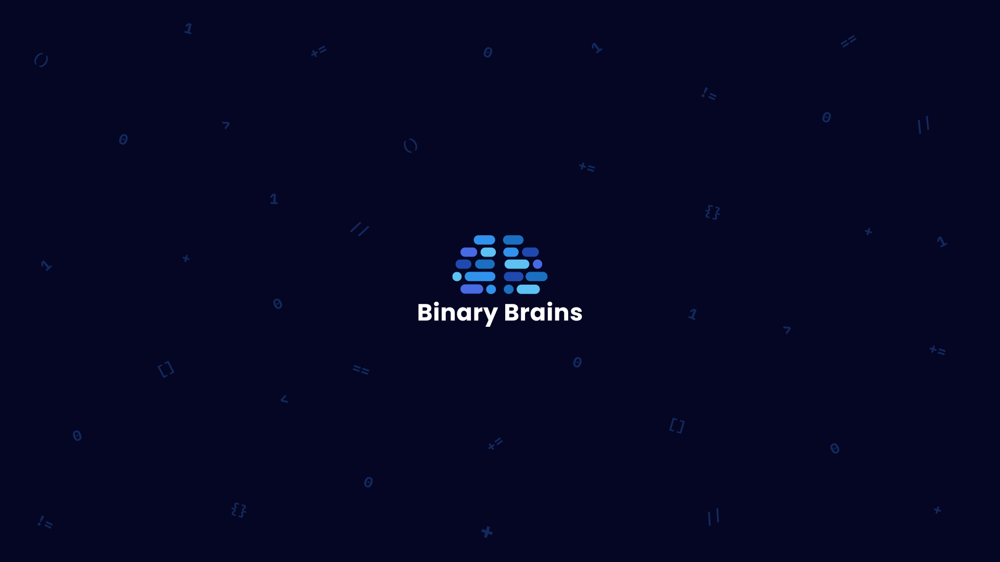
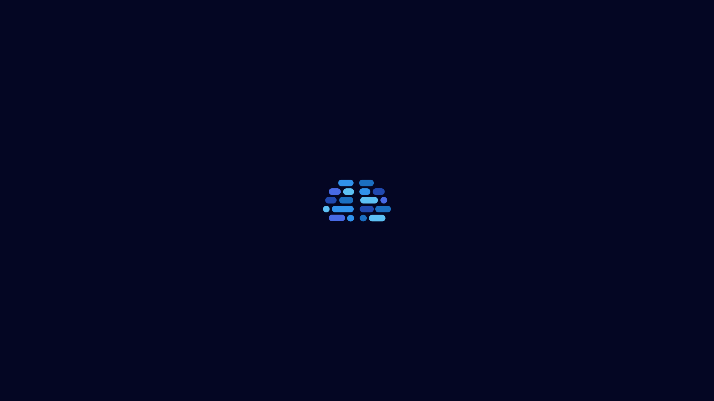

# 🎨 Media Kit - Binary Brains

Bienvenido al **Media Kit oficial** de la comunidad de desarrollo **Binary Brains**. Aquí encontrarás todos los recursos visuales y de marca que necesitas para promover, compartir y colaborar con nuestra comunidad.

Este repositorio contiene logos, imágenes para redes sociales, wallpapers y más materiales gráficos listos para usar en tus proyectos, presentaciones y publicaciones.

---

## 📁 Contenido del Repositorio

### 🎯 Logo

Logotipos oficiales de Binary Brains en diferentes versiones:

#### Versión 1

#### Versión 2

---

### 📱 Social Media

Recursos optimizados para redes sociales, perfectos para publicaciones, historias y contenido digital:

#### Recurso 8

#### Recurso 10

---

### 🖼️ Wallpapers

Fondos de pantalla de Binary Brains para personalizar tus dispositivos:

#### Wallpaper Binary

#### Wallpaper Binary con Logo

---

## 🌐 Redes Sociales

¡Síguenos y etiquétanos en nuestras redes sociales!

### 📸 Instagram
**[@bbupiicsa](https://instagram.com/bbupiicsa)**

### 💼 LinkedIn
**[binary-brains-upiicsa](https://www.linkedin.com/company/binary-brains-upiicsa)**

---

## 🏷️ ¿Usaste nuestros recursos?

**¡Nos encantaría saberlo!** Si utilizas algún recurso de este media kit en tus publicaciones, proyectos o eventos, etiquétanos:

- 📱 En Instagram: **@bbupiicsa**
- 💼 En LinkedIn: **binary-brains-upiicsa**

Tu apoyo nos ayuda a crecer como comunidad. 💙

---

## 📄 Licencia

Todos los recursos de este media kit son propiedad de **Binary Brains** y están destinados para uso promocional y educativo de la comunidad.

---

**Hecho con 💙 por Binary Brains**

